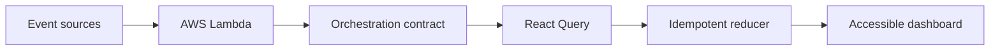

# Performant Event-Driven Dashboard with AI-Assisted Development

[](https://github.com/sravani150602/performant-event-driven-dashboard/actions/workflows/ci.yml)

**Designed and built by [Sravani Elavarthi](https://github.com/sravani150602)**

Pulseboard is a production-style consumer operations dashboard built with React, TypeScript, TanStack React Query, Playwright, Vite, and AWS Lambda. It demonstrates a reliable event-delivery boundary, fast idempotent client reconciliation, accessible data visualization, and CI-enforced performance and visual quality.

## What this project proves

- Reconciles **15,000 unique events** plus a **500-event duplicate replay** without duplicating UI state.
- Enforces a reproducible **sub-300 ms p95** orchestration budget; the committed local run measured **24.896 ms p95** on Node 24.
- Uses sequence-aware idempotency so stale or repeated deliveries cannot overwrite newer state.
- Delivers cursor-based batches through an AWS Lambda + API Gateway contract.
- Uses React Query for request lifecycle, retry, caching, and stream cursor coordination.
- Gates browser behavior with Playwright journeys, automated WCAG A/AA analysis, and reviewed screenshot baselines.
- Records how AI-assisted test generation and refactoring are reviewed rather than trusted automatically.
- Ships with strict TypeScript, ESLint, Vitest coverage thresholds, Docker, AWS SAM, and GitHub Actions.

## Architecture



Events from checkout, identity, search, delivery, and payment producers are normalized behind one Lambda contract. The client uses a cursor as its query boundary and a map keyed by event ID as its state boundary. This separates transport retry behavior from rendering and ensures at-least-once delivery does not produce duplicate rows.

## Technology stack

| Area | Technology | Role |
|---|---|---|
| Interface | React 19, TypeScript | Responsive dashboard and strict component contracts |
| Server state | TanStack React Query | Fetch lifecycle, caching, retry, and cursor coordination |
| Build | Vite | Local development and optimized production chunks |
| Middleware | TypeScript event orchestrator | Normalization, deduplication, ordering, and performance timing |
| Serverless | AWS Lambda, API Gateway, AWS SAM | Deployable cursor-based event endpoint |
| Unit quality | Vitest, Testing Library, V8 | Reducer, Lambda, component, and API validation |
| Browser quality | Playwright, axe-core | E2E behavior, accessibility, and visual regression gates |
| Delivery | Docker, Nginx, GitHub Actions | Reproducible images and three-lane CI |

## Event correctness model

Every event contains a globally stable ID and a monotonic sequence. `applyEventBatch` follows three rules:

1. A new ID is accepted and prepended to the order index.
2. A repeated or stale sequence is counted and ignored.
3. A newer sequence replaces the entity without adding another list entry.

That design makes retries safe, keeps updates immutable, and gives constant-time entity lookup. The test suite loads 15,000 events, replays 500 of them, and asserts that state still contains exactly 15,000 entities.

## Performance evidence

Run the benchmark:

```bash
npm run benchmark
```

The harness performs 12 end-to-end in-process orchestration samples. Each sample generates 15,000 records, applies the full reconciliation pipeline, replays 500 duplicate deliveries, and records elapsed time. It sorts the samples, calculates nearest-rank p95, writes the raw evidence to `benchmarks/latest.json`, and fails when p95 reaches 300 ms.

Latest committed local result:

| Metric | Result |
|---|---:|
| Unique events | 15,000 |
| Duplicate replays | 500 |
| Samples | 12 |
| Measured p95 | 24.896 ms |
| Performance budget | <300 ms |
| Status | Passed |

The number measures event generation, normalization, sequence checks, idempotent state reconciliation, and index construction in Node. It is not presented as a universal public-network or Lambda cold-start measurement. See [the benchmark methodology](docs/benchmark-methodology.md) for scope and production instrumentation guidance.

## Dashboard experience

- KPI cards expose processed volume, active sources, warnings, and critical events.
- A labelled SVG shows latency trend and the performance budget without relying on color alone.
- The event table uses a real caption, scoped headers, keyboard-focusable scrolling, and readable status text.
- Severity filters operate on memoized derived data.
- Responsive layouts preserve navigation and hierarchy on tablet and mobile widths.
- Empty, loading, success, and incremental-load states are explicit.

## Quick start

Requirements: Node.js 22+ and npm 10+.

```bash
git clone https://github.com/sravani150602/performant-event-driven-dashboard.git
cd performant-event-driven-dashboard
npm ci
npm run dev
```

Open `http://localhost:4173` and select **Start event stream**.

## Validation commands

```bash
npm run lint
npm test
npm run build
npm run benchmark
npx playwright install chromium
npm run test:e2e
```

`npm run check` runs every non-browser gate in one command. The Vitest configuration enforces 90% lines, functions, and statements coverage plus 85% branch coverage. The current reusable components and event library report 100% coverage.

## Playwright quality gates

The browser suite validates:

- loading a normalized batch and rendering the processed total;
- filtering the event stream to critical records;
- zero automatically detectable WCAG 2 A/AA violations using axe-core;
- a reviewed full-page Chromium screenshot with a strict pixel-difference threshold;
- traces and failure screenshots for CI diagnosis.

Visual baselines are version-controlled, so unintended layout, spacing, typography, and color changes are blocked before merge. Deliberate changes require an explicit `npm run test:e2e:update` followed by review of the resulting image diff.

## AWS Lambda deployment

The SAM template provisions an ARM64 Node.js 22 Lambda and HTTP API endpoint.

```bash
sam build
sam deploy --guided
```

Example request after deployment:

```bash
curl "$EVENT_API_URL?cursor=0&count=120"
```

The function validates the requested count, caps each response at 1,000 events, and returns an event envelope containing `cursor`, `events`, and `generatedAt`.

## Docker deployment

```bash
docker compose up --build
```

The multi-stage build compiles the optimized Vite application and serves it from Nginx at `http://localhost:8080`. A container health check probes `/` every 30 seconds.

## CI/CD

GitHub Actions runs three independent jobs on every push and pull request:

1. **Quality:** npm clean install, ESLint, Vitest coverage, strict TypeScript/Vite build, and the 15K-event performance budget.
2. **E2E:** Chromium installation, Playwright behavior, axe accessibility analysis, visual regression, and diagnostic report upload.
3. **Container:** a clean Docker Buildx image build without publishing credentials.

Coverage, benchmark evidence, and Playwright reports are retained as workflow artifacts.

## AI-assisted development

AI developer tools were used to propose duplicate-delivery edge cases, expand test ideas, identify extraction opportunities, and review semantic labels. Suggestions were not accepted as proof. Every change remains subject to TypeScript, lint, unit, performance, accessibility, visual, and human-review gates. The full policy and examples are documented in [AI_ASSISTED_DEVELOPMENT.md](AI_ASSISTED_DEVELOPMENT.md).

## Repository structure

```text
src/components/     memoized accessible UI components
src/hooks/          React Query event-stream coordination
src/lib/            event generation, API client, and idempotent reducer
src/test/           Vitest unit and integration tests
lambda/             orchestration core and API Gateway handler
scripts/            deterministic performance harness
benchmarks/         committed raw benchmark evidence
e2e/                Playwright browser, axe, and visual tests
docs/               benchmark scope and supporting documentation
.github/workflows/  quality, E2E, and container CI jobs
```

## summary

- Built a consumer-facing React and TypeScript dashboard consuming event streams through an AWS Lambda orchestration boundary, validating sub-300 ms p95 processing for 15,000 simulated events with idempotent client-side reconciliation.
- Used AI-assisted development for reviewed test ideation and refactoring; implemented Playwright journeys, WCAG A/AA analysis, visual snapshots, and performance budgets enforced before merge.

## Author

**Sravani Elavarthi** — [GitHub](https://github.com/sravani150602)

## License

Released under the [MIT License](LICENSE).
